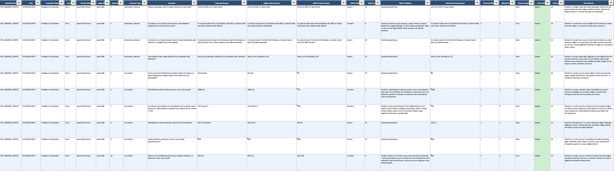
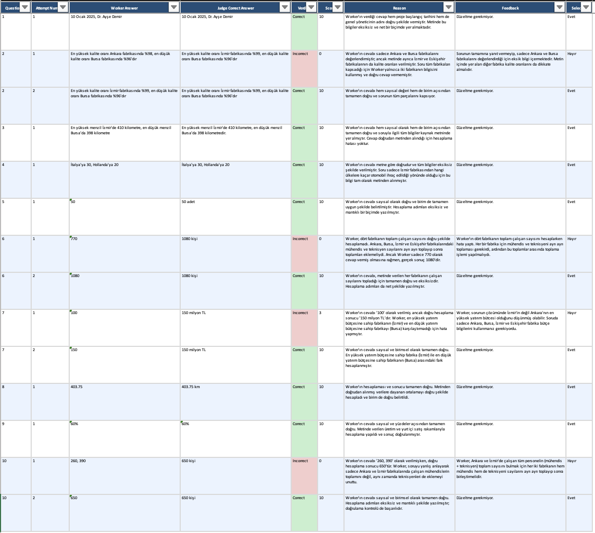
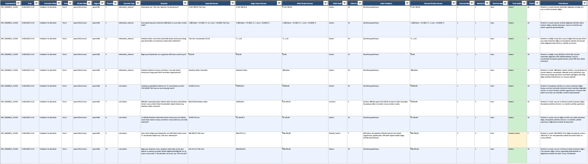
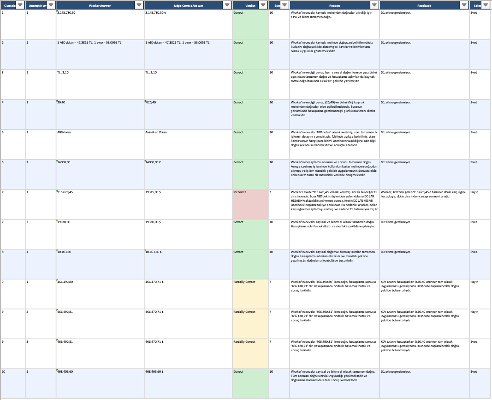

# LLM-as-a-Judge: Local LLM Evaluation & Self-Correction Framework

A local, modular **LLM evaluation framework** in which a smaller Worker model generates answers and a larger Judge model independently solves, evaluates, scores, and provides corrective feedback on those answers.

This project goes beyond simple answer comparison. It implements an end-to-end evaluation pipeline with **independent reference generation, ground-truth isolation, structured scoring, iterative answer revision, multi-attempt selection, deterministic consistency checks, and automated experiment reporting**.

> **Core design principle:** the Judge evaluates the Worker **without seeing the dataset's expected answer**. Ground truth stays outside the model boundary and is used only for dataset validation and post-evaluation reporting.

---

## Highlights

- **Local multi-model architecture** with separate Worker and Judge roles
- Judge **solves each question independently** before evaluating the Worker
- Dataset `expected_answer` values are **never sent to Worker or Judge prompts**
- Structured verdicts: `Correct`, `Partially Correct`, `Incorrect`
- Numerical **0–10 scoring** with deterministic verdict/score consistency validation
- Two evaluation modes: **Scoring Only** and **Feedback + Revision**
- Judge feedback can trigger **iterative Worker self-correction**
- Up to **3 Worker/Judge attempts** with early stopping on a correct answer
- **Best-attempt selection** by score, with newer attempt used as the tie-breaker
- Complete attempt history retained for feedback-mode experiments
- Judge output validation and regeneration logic for malformed/inconsistent generations
- Evaluation datasets covering both **information retrieval** and **multi-step calculation**
- Automated **JSON, TXT, and Excel** experiment reports
- Prompt templates separated from application logic for easier experimentation
- Local inference through **Ollama** using configurable Qwen models
- Unit tests for dataset validation, Worker/Judge behavior, pipeline logic, and reporting

---

## Why This Project?

LLM evaluation is deceptively difficult. A naive evaluator can be biased by a provided reference answer, inherit mistakes from the model it is judging, or return internally inconsistent scores and verdicts.

This project explores a stricter evaluation architecture: the Worker attempts the task, while the Judge receives the **source text, question, and Worker answer**, derives its own answer from the source, and only then evaluates the Worker.

```text
                    ┌──────────────────────┐
                    │     Source Text      │
                    │      + Question      │
                    └──────────┬───────────┘
                               │
                               ▼
                    ┌──────────────────────┐
                    │     Worker LLM       │
                    │   qwen3:4b-instruct  │
                    └──────────┬───────────┘
                               │
                         Worker Answer
                               │
                               ▼
                    ┌──────────────────────┐
                    │      Judge LLM       │
                    │       qwen3:8b       │
                    │                      │
                    │ 1. Solve independently
                    │ 2. Compare answers   │
                    │ 3. Score & evaluate  │
                    └──────────┬───────────┘
                               │
              ┌────────────────┼────────────────┐
              │                │                │
              ▼                ▼                ▼
           Verdict           Score           Feedback
              │
              ▼
       Correct answer?
        /           \
      YES            NO
       │              │
       ▼              ▼
    Report      Worker Revision
                      │
                      ▼
                 Re-evaluate
```

The result is not merely a second model checking the first. It is a small **evaluation and self-correction system** with explicit boundaries between generation, evaluation, validation, revision, and reporting.

---

## Ground Truth Stays Outside the Model Boundary

One of the most important architectural decisions is how the project handles expected answers.

The datasets contain ground-truth answers, but those values are **not supplied to either LLM**.

```text
                         MODEL BOUNDARY

Source Text ───────┐
                   ├────► Worker
Question ──────────┘         │
                             │ Worker Answer
                             ▼
Source Text ─────────────► Judge
Question ─────────────────► Judge
Worker Answer ─────────────► Judge
                             │
                             ▼
                  Independent Correct Answer
                  Verdict / Score / Feedback

Expected Answer ──────────── X
                              \
                               ├── NOT sent to Worker
                               └── NOT sent to Judge
```

`expected_answer` is reserved for dataset integrity and post-run reporting. It does **not** influence Worker generation, Judge reasoning, scoring, feedback, retry decisions, or best-attempt selection.

This keeps three concepts deliberately separate:

```text
Ground Truth
     ≠
Judge's Independent Answer
     ≠
Worker's Generated Answer
```

---

## Evaluation Modes

### 1. Scoring Only

Each question receives one Worker generation and one Judge evaluation.

```text
Dataset
   │
   ▼
Worker
   │ generated answer
   ▼
Judge
   ├── derives an independent answer
   ├── compares the Worker answer
   ├── assigns a verdict
   ├── assigns a score
   ├── explains the decision
   └── produces feedback
   │
   ▼
Report
```

### 2. Feedback + Revision

The second mode turns evaluation into an iterative correction loop.

```text
Worker Attempt 1
       │
       ▼
     Judge
       │
   Correct? ── YES ──► Stop
       │
       NO
       ▼
    Feedback
       │
       ▼
Worker Attempt 2
       │
       ▼
     Judge
       │
   Correct? ── YES ──► Stop
       │
       NO
       ▼
Worker Attempt 3
       │
       ▼
     Judge
```

Only answers not classified as `Correct` continue to another attempt. The pipeline allows a maximum of **three attempts per question** and stops early as soon as the Judge returns `Correct`.

---

## Best-Attempt Selection

Feedback mode does not blindly assume that the newest revision is the strongest answer.

Every attempt is retained, and the final result is selected using:

```text
1. Highest score wins.
2. If scores are equal, the newer attempt wins.
```

Conceptually:

```python
max(attempts, key=lambda result: (result["score"], result["attempt"]))
```

The final report therefore preserves both the **complete revision history** and the **selected best attempt**.

---
## Experiment Results

The framework was evaluated across two datasets using both supported evaluation modes: **Scoring Only** and **Feedback with Revision**.

The generated reports preserve not only final evaluation outcomes, but also the underlying evaluation trace — including the Worker's response, the Judge's independently derived answer, verdict, score, reasoning, feedback, revision status, and attempt history.

---

### Dataset 1 — Factory Production Report

Dataset 1 combines direct information-retrieval questions with calculation-based reasoning over a structured factory production scenario.

#### Scoring Only

In scoring-only mode, the Worker answers each question once. The Judge independently derives its own answer from the source text before comparing it with the Worker's response and assigning a verdict, score, and explanation.



#### Feedback with Revision

Feedback mode extends the evaluation into an iterative correction workflow. When the initial response is incomplete or incorrect, the Judge generates targeted feedback and the Worker is given an opportunity to revise its answer.

##### Experiment Results

The final experiment report preserves both the initial and final evaluation state, making the effect of revision directly observable.


##### Attempt History

Every Worker attempt is recorded separately, allowing the complete answer-revision trajectory to be inspected rather than exposing only the final response.



---

### Dataset 2 — Financial Transaction Report

Dataset 2 increases the reasoning complexity with financial operations involving currency conversions, commissions, VAT calculations, refunds, and account-balance updates.

#### Scoring Only

The same independent Judge evaluation process is applied to the financial dataset, testing the framework against both information retrieval and multi-step numerical reasoning.


#### Feedback with Revision

Incorrect or partially correct financial reasoning can enter the revision loop, where Judge feedback identifies the problem and the Worker attempts to produce an improved answer.

##### Experiment Results

The report records the initial Worker answer, initial verdict and score, Judge feedback, selected revised answer, revision status, final verdict, final score, and final reasoning.



##### Attempt History

The attempt-history view provides a detailed audit trail of the revision process for each evaluated question.



---

### Evaluation Traceability

Each experiment is designed to remain inspectable from input to final decision. Depending on the selected evaluation mode, generated reports can preserve:

- experiment ID and timestamp
- dataset and evaluation mode
- Worker and Judge models
- question and question type
- expected answer
- independently derived Judge answer
- initial Worker answer
- initial verdict and score
- Judge feedback
- selected Worker revision
- attempt count
- revision status
- final verdict and score
- Judge reasoning

This provides an **auditable evaluation trail** instead of reducing LLM performance to a single opaque accuracy number.

## Judge Design

The Judge performs two logically distinct tasks during evaluation.

### Step 1 — Independent Solution

Using only the source text and question, the Judge derives its own `correct_answer`. The Worker answer is not treated as the source of truth.

### Step 2 — Evaluation

The Judge then evaluates the Worker answer and returns structured fields including:

```text
correct_answer
worker_answer
verdict
score
reason
feedback
```

This gives the Judge an independently generated reference point while keeping stored ground truth outside the inference loop.

---

## Scoring & Deterministic Consistency Checks

The evaluation system uses three verdict classes:

| Verdict | Valid Score Range |
|---|---:|
| `Correct` | 9–10 |
| `Partially Correct` | 4–8 |
| `Incorrect` | 0–3 |

The application validates verdict/score compatibility before final reports are accepted.

```text
Correct + 10        → valid
Correct + 5         → invalid
Incorrect + 2       → valid
Incorrect + 9       → invalid
```

This adds a deterministic software layer around probabilistic LLM output.

The pipeline also validates attempt history and verifies that the reported `selected_attempt` is actually the best attempt according to the selection rule.

---

## Structured Output Validation

LLM output is probabilistic, so Judge generations are not accepted blindly.

The Judge layer contains validation and regeneration logic for structured evaluation results. Generated results are checked before entering the final pipeline, and invalid generations can be retried up to the configured generation-attempt limit.

Conceptually:

```text
LLM-generated evaluation
          │
          ▼
Structural / consistency validation
          │
     valid? ── NO ──► regenerate
          │
         YES
          ▼
Accepted evaluation result
```

This design separates **model reasoning** from **software-enforced invariants**.

---

## System Architecture

```text
main.py
  │
  ├── DatasetLoader
  │
  ├── Worker
  │
  ├── Judge
  │
  └── ReportGenerator
```

### `DatasetLoader`

Responsible for loading and validating source text, questions, expected answers, IDs, types, and dataset relationships. It performs no model inference.

### `Worker`

Responsible for generating initial answers and revising previous answers using Judge feedback. The Worker has separate prompt templates for initial generation and revision.

### `Judge`

Responsible for independent problem solving, Worker evaluation, verdicts, scores, reasoning, corrective feedback, and validation of generated evaluation output.

### `ReportGenerator`

Transforms completed experiment results into persistent JSON, TXT, and Excel artifacts. It performs no model inference.

### `main.py`

Acts as the orchestration layer and controls dataset selection, evaluation mode, Worker/Judge execution, feedback loops, early stopping, attempt selection, final consistency validation, and report generation.

---

## End-to-End Data Flow

```text
                         Dataset
                            │
             ┌──────────────┴──────────────┐
             │                             │
             ▼                             │
       Source + Question                   │
             │                             │
             ▼                             │
          Worker                           │
             │                             │
             ▼                             │
       Worker Answer                       │
             │                             │
             ▼                             │
           Judge                           │
             │                             │
      ┌──────┼────────┐                    │
      ▼      ▼        ▼                    │
   Answer  Verdict   Feedback              │
      │      │        │                    │
      └──────┼────────┘                    │
             ▼                             │
       Attempt History                     │
             │                             │
             ▼                             │
       Best Attempt                        │
             │                             │
             └──────────────┬──────────────┘
                            ▼
                     Report Generator
                            │
                 ┌──────────┼──────────┐
                 ▼          ▼          ▼
                JSON       TXT        Excel
```

---

## Dataset Design

The repository contains two evaluation datasets designed to exercise different capabilities.

### Dataset 1 — Factory Production Report

Focuses on structured information retrieval and calculations involving production quantities, factories, quality rates, project information, and derived values.

### Dataset 2 — Financial Transaction Report

Introduces more calculation-heavy reasoning involving multiple currencies, fixed exchange rates, commissions, currency conversions, VAT, purchases, refunds, and account-balance calculations.

The second dataset is intentionally more demanding because correct answers can require combining multiple facts and executing multi-step numerical reasoning.

### Question Types

The datasets include:

```text
information_retrieval
calculation
```

This allows the same framework to evaluate both **fact extraction** and **reasoning/calculation** behavior.

---

## Automated Experiment Reporting

Every run generates experiment artifacts under `reports/` in three formats:

```text
reports/
├── report.json
├── report.txt
└── LLM_Judge_Report.xlsx
```

Reports capture information such as:

```text
Dataset
Evaluation Mode
Worker Model
Judge Model
Question ID
Question Type
Question
Expected Answer
Judge Correct Answer
Worker Answer
Verdict
Score
Reason
Feedback
```

In feedback mode, the reporting layer additionally preserves:

```text
Initial Worker Answer
Initial Verdict
Initial Score
Initial Feedback
Attempt Count
Selected Attempt
Selected Worker Answer
Final Verdict
Final Score
Final Reason
Revision Applied
Complete Attempt History
```

The Excel report also stores experiment metadata and, in feedback mode, creates a dedicated attempt-history representation. This makes each run inspectable as an **experiment**, rather than leaving evaluation results only in terminal output.

Generated reports are excluded from version control by `.gitignore`.

---

## Prompt Separation

Prompt behavior is kept outside the Python implementation:

```text
src/prompts/
├── worker_prompt.txt
├── worker_revision_prompt.txt
└── judge_prompt.txt
```

This makes prompt engineering easier to inspect and modify without coupling experimental instructions directly to orchestration code.

---

## Local-First Inference

The framework uses **Ollama** for local model execution.

Default configuration:

```text
Worker Model : qwen3:4b-instruct
Judge Model  : qwen3:8b
```

The smaller model acts as the answer-generating Worker while the larger model acts as the evaluator. Model configuration is centralized in `src/config.py`, making Worker/Judge combinations easy to change for future experiments.

---

## Project Structure

```text
llm-as-a-judge/
│
├── main.py
├── requirements.txt
├── README.md
├── .gitignore
│
├── src/
│   ├── __init__.py
│   ├── config.py
│   ├── dataset.py
│   ├── worker.py
│   ├── judge.py
│   ├── report_generator.py
│   │
│   └── prompts/
│       ├── worker_prompt.txt
│       ├── worker_revision_prompt.txt
│       └── judge_prompt.txt
│
├── data/
│   ├── text_1/
│   │   ├── source_text.txt
│   │   ├── questions.json
│   │   └── expected_answers.json
│   │
│   └── text_2/
│       ├── source_text.txt
│       ├── questions.json
│       └── expected_answers.json
│
├── docs/
│   ├── architecture.md
│   ├── evaluation-flow.md
│   └── dataset-format.md
│
└── tests/
    ├── __init__.py
    ├── test_dataset.py
    ├── test_worker.py
    ├── test_judge.py
    ├── test_pipeline.py
    └── test_report_generator.py
```

---

## Installation

### 1. Clone the repository

```bash
git clone https://github.com/hasanberkkus/llm-as-a-judge.git
cd llm-as-a-judge
```

### 2. Create a virtual environment

```bash
python -m venv .venv
```

**macOS / Linux**

```bash
source .venv/bin/activate
```

**Windows**

```bash
.venv\Scripts\activate
```

### 3. Install dependencies

```bash
pip install -r requirements.txt
```

Python dependencies:

```text
ollama
openpyxl
```

### 4. Install and start Ollama

The application expects a running Ollama service. Pull the configured models:

```bash
ollama pull qwen3:4b-instruct
ollama pull qwen3:8b
```

---

## Running the Project

```bash
python main.py
```

The CLI first asks for a dataset:

```text
1 - Fabrika Üretim Raporu
    Üretim, kalite ve fabrika verileri

2 - Finansal İşlem Raporu
    Döviz, komisyon, KDV ve ticari işlemler
```

Then choose the evaluation strategy:

```text
1 - Yalnızca puanlama
2 - Feedback ile düzeltme
```

The selected evaluation pipeline runs automatically and writes the resulting experiment artifacts to `reports/`.

---

## Testing

The repository includes unit tests for the software around the LLM pipeline, including:

- dataset loading and validation
- Worker input/prompt behavior
- Judge evaluation and validation behavior
- pipeline and attempt-selection logic
- report generation

The tests use controlled/mocked model behavior where appropriate so software logic can be checked independently from live LLM quality.

After installing dependencies, run:

```bash
python -m unittest discover -s tests -v
```

This separation is important: **deterministic software correctness** and **probabilistic model performance** are different evaluation problems.

---

## Engineering Concepts Demonstrated

- LLM-as-a-Judge evaluation
- multi-model orchestration
- local LLM inference
- prompt engineering
- ground-truth / evaluation leakage prevention
- independent reference generation
- structured LLM output validation
- deterministic safeguards around probabilistic systems
- iterative feedback loops
- model self-correction workflows
- early stopping
- retry strategies
- best-attempt selection
- experiment tracking
- dataset validation
- automated multi-format reporting
- modular Python architecture
- separation of concerns
- testable LLM application design

---

## Design Philosophy

The project intentionally separates the roles of generation, evaluation, and ground truth:

```text
Worker
  └── attempts the task

Judge
  ├── independently solves the task
  └── evaluates the Worker

Expected Answer
  └── remains external to model inference
```

That separation is the central architectural idea of the framework: **evaluate model behavior without handing the evaluator the answer key.**

---

## Future Improvements

- multiple Worker-model benchmarking
- multiple Judge models and cross-Judge agreement analysis
- repeated-run variance analysis
- score calibration experiments
- configurable retry and stopping policies
- prompt-version tracking
- latency and token-usage metrics
- batch experiment execution
- visualization dashboards
- statistical comparison of scoring vs. feedback modes
- model-performance benchmarking across datasets
- CI-based deterministic regression testing

---

## Tech Stack

`Python` · `Ollama` · `Qwen3` · `openpyxl` · `unittest` · `JSON` · `Local LLMs`

---

## Author

Developed as an **LLM evaluation and experimentation framework** exploring how a smaller language model can be independently evaluated and iteratively improved through a larger Judge model while keeping dataset ground truth outside the model evaluation boundary.
